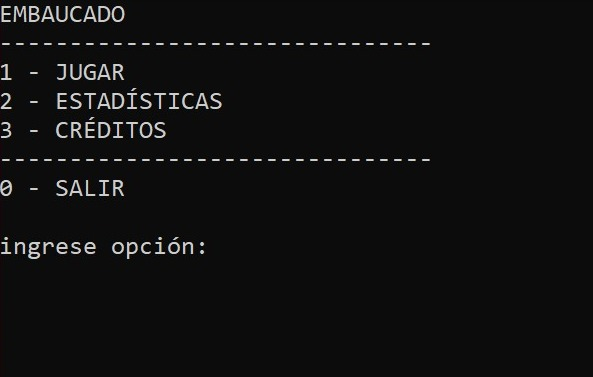
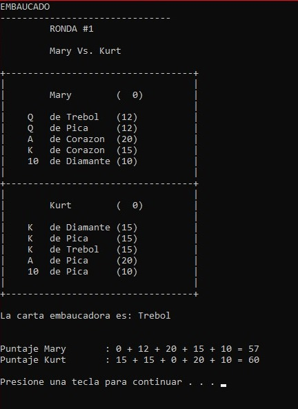
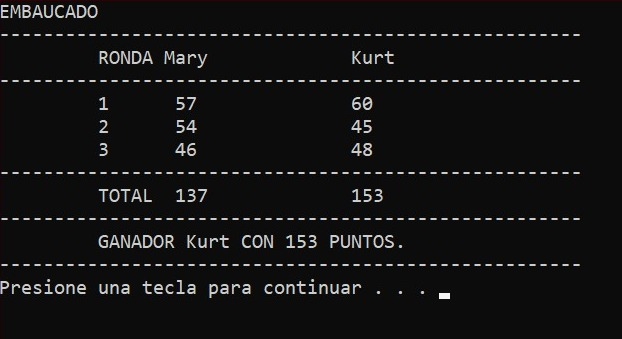
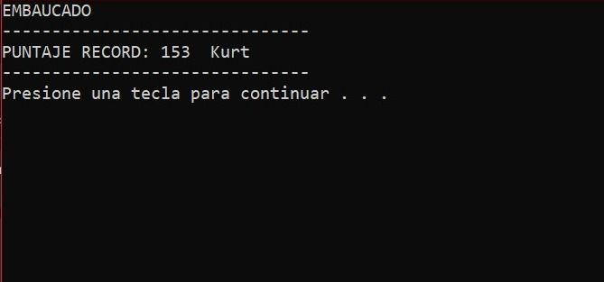

# Embaucado - Juego de Consola en C++

Este es un juego de naipes para dos jugadores desarrollado íntegramente en **C++** como parte de un trabajo práctico para la materia **Programación I**. El objetivo es acumular la mayor cantidad de puntos a lo largo de tres rondas, evitando que la carta "embaucadora" anule el valor de tu mano.

---

## El Juego

**Embaucado** utiliza una versión reducida de la baraja francesa (10, J, Q, K y A de cada palo) y un mazo especial de 4 figuras que determinan qué palo será el "embaucador" en cada ronda.

### Reglas Principales
*   **Duración:** El juego consta de 3 rondas.
*   **La Mano:** Cada jugador recibe 5 cartas al azar por ronda.
*   **La Embaucadora:** Al inicio de cada ronda se revela una figura (Corazón, Diamante, Pica o Trébol). Las cartas en la mano del jugador que coincidan con este palo **no sumarán puntos**.
*   **Mecánica de Sacrificio:** A partir de la segunda ronda, un jugador puede decidir sacrificar **20 puntos** de su acumulado para cambiar la carta embaucadora por otra nueva, siempre que disponga del puntaje suficiente.

### Tabla de Puntuación
Si la carta no ha sido embaucada, su valor se calcula según la siguiente tabla:

| Naipe | Puntaje |
| :---: | :-----: |
| **10** | 10 pts |
| **J**  | 11 pts |
| **Q**  | 12 pts |
| **K**  | 15 pts |
| **A**  | 20 pts |

### Criterio de Victoria
Gana quien obtenga más puntos totales tras las 3 rondas. En caso de **empate**, se define por:
1.  El jugador que haya obtenido el puntaje más alto en una sola ronda.
2.  Si persiste el empate, se declara empate final.

---

## Características Técnicas

*   **Lenguaje:** C++
*   **Interfaz:** Línea de comandos (CLI).
*   **Funcionalidades:**
    *   Menú principal interactivo.
    *   Sistema de registro de nombres con confirmación.
    *   Lógica de barajado aleatorio para naipes y figuras.
    *   Gestión de turnos y prioridades para el sacrificio de puntos según la ronda.
    *   Algoritmos de cálculo de puntajes y desempate.

---

## Capturas del Juego

A continuación se muestran algunas capturas de pantalla de la interfaz de consola del juego:

**Menú Principal:** 

**Desarrollo de la Ronda:** 

**Resultados Finales:** 

**Estadísticas:** 

---

> **Nota:** Este proyecto fue realizado bajo las consignas del Examen Integrador de Programación I, enfocado en el uso de estructuras de control, arreglos, funciones y lógica algorítmica.

